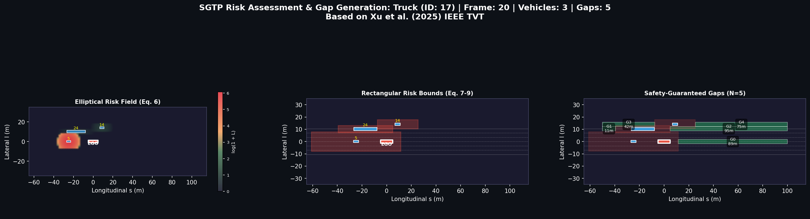

# exiD Interaction Fields Modeling
Modelling of state-of-the-art Interaction Fields with Social Value Orientation based on exiD dataset
(My exiD dataset has been archived in "C:\exiD-tools\data", so the data directory needs to be tailored for other users)

# GVF Modeling
The Gaussian Velocity Field (GVF) is a mathematical model used to represent interactions between multiple vehicles during lane-change scenarios. The GVF is defined in a Region of Interest (ROI) around an ego vehicle and captures the relative velocity field generated by surrounding vehicles.
Key Features

- Data Loading: Parse exiD dataset CSV files (tracks, tracksMeta, recordingMeta)
- GVF Construction: Build velocity fields using Gaussian Process regression
- Visualization: Plot GVF with vehicle positions and background images
- Logging: Save GVF data in multiple formats (NPZ, CSV, JSON)
- Analysis: Compute features and statistics from velocity fields

visualization of Gaussian Velocity Fields of ego truck and surrounding vehicles:
```shell
python exid_gvf_svo_visualization.py --data_dir "C:\exiD-tools\data" --recording 25
```


# Mechanical Wave (Aggressiveness) Modeling
visualization of Aggressiveness Distributions of ego truck and surrounding vehicles:
```shell
python exid_mech_svo_visualization.py --data_dir "C:\exiD-tools\data" --recording 25
```


# Group Aggressiveness Modeling
visualization of Aggressiveness Distributions of ego truck and surrounding vehicles (aggregated as a group):
```shell
python exid_mech_group_visualization.py --data_dir "C:\exiD-tools\data" --recording 25
```


# Safe Corridor with Gap Assessment Modeling
visualization of mutual SVO with symmetric evaluations:
```shell
python exid_sgtp_gap.py --data_dir "C:\exiD-tools\data" --recording 25 --output_dir "./enhanced_output"
```


# APF Modeling
visualization of mutual SVO with symmetric evaluations:
```shell
python exid_enhanced_svo_visualization.py --data_dir "C:\exiD-tools\data" --recording 25 --output_dir "./enhanced_output"
```

visualization of SVO with APF in selected recording frame (example: 25):
```shell
python exid_svo_apf_visualization.py --data_dir "C:\exiD-tools\data" --recording 25 --output_dir "./output"
```

# car interaction visualization (enhanced version, pending frame enhancements):
```shell
# Interactive visualization (main program)
python exid_optimized_visualization.py --data_dir /path/to/exid/data --recording 25

# Static analysis plots
python exid_corrected_svo_visualization.py --data_dir /path/to/exid/data --recording 25
```

## The following programs need the activation of "drone-dataset-tool38":
```shell
cd "C:\exiD-tools\data"
cd src
conda activate drone-dataset-tools38
```

detailed instructions found at: https://github.com/zxc-tju/exiD-tools/tree/master

## Dataset structure: 
```shell
C:\exiD-tools\data\
├── 00_tracks.csv
├── 00_tracksMeta.csv
├── 00_recordingMeta.csv
├── 00_background.png
├── 01_tracks.csv
├── ...
├── 25_tracks.csv          ← recording
├── 25_tracksMeta.csv      ← Vehicle metadata
├── 25_recordingMeta.csv   ← Recording info
├── 25_background.png      ← Aerial image
├── ...
└── Maps/
    ├── location1.osm      ← Lanelet2 HD map
    └── location1.xodr     ← OpenDrive HD map
```

Acknowledgement of the dataset:
```
@inproceedings{exiDdataset,
               title={The exiD Dataset: A Real-World Trajectory Dataset of Highly Interactive Highway Scenarios in Germany},
               author={Moers, Tobias and Vater, Lennart and Krajewski, Robert and Bock, Julian and Zlocki, Adrian and Eckstein, Lutz},
               booktitle={2022 IEEE Intelligent Vehicles Symposium (IV)},
               pages={958-964},
               year={2022},
               doi={10.1109/IV51971.2022.9827305}}
```
