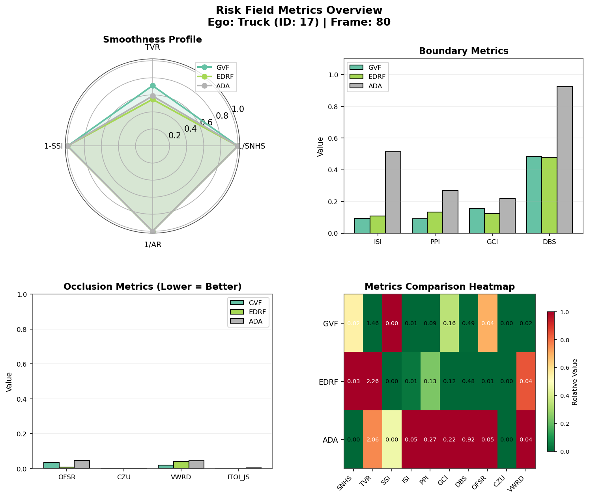

## Implemented Metrics
### 1. Gradient Smoothness Metrics
- SNHS
- ASD_s/ASD_d
- AR
- TVR
- SSI
### 2. Safe/Unsafe Boundary Metrics
- ISI
- PPI
- BCI
- GCI
- DBS
### 3. Occlusion/Uncertainty Metrics
- MU
- CZU
- OFSR

risk_field_metrics.py — Core metrics implementation with standalone demo

exid_metrics_integration.py — Integration with exiD data loader

### Example outputs:



### Usage with exiD
```shell
python exid_metrics_integration.py --data_dir /path/to/exiD --recording 25 --ego_id 123 --frame 500 --methods gvf edrf ada
```
### for unified evaluation
```shell
# Demo mode (no data required)
python unified_metrics_integration.py --demo --methods gvf edrf ada apf

# Only field metrics on specific methods
python unified_metrics_integration.py --demo --methods gvf ada --metrics field

# Only behavioral metrics
python unified_metrics_integration.py --demo --methods gvf apf --metrics behavioral

# With exiD data
python unified_metrics_integration.py --data_dir ./exiD --recording 25 --ego_id 123

# Save to JSON
python unified_metrics_integration.py --demo --output results.json
```
